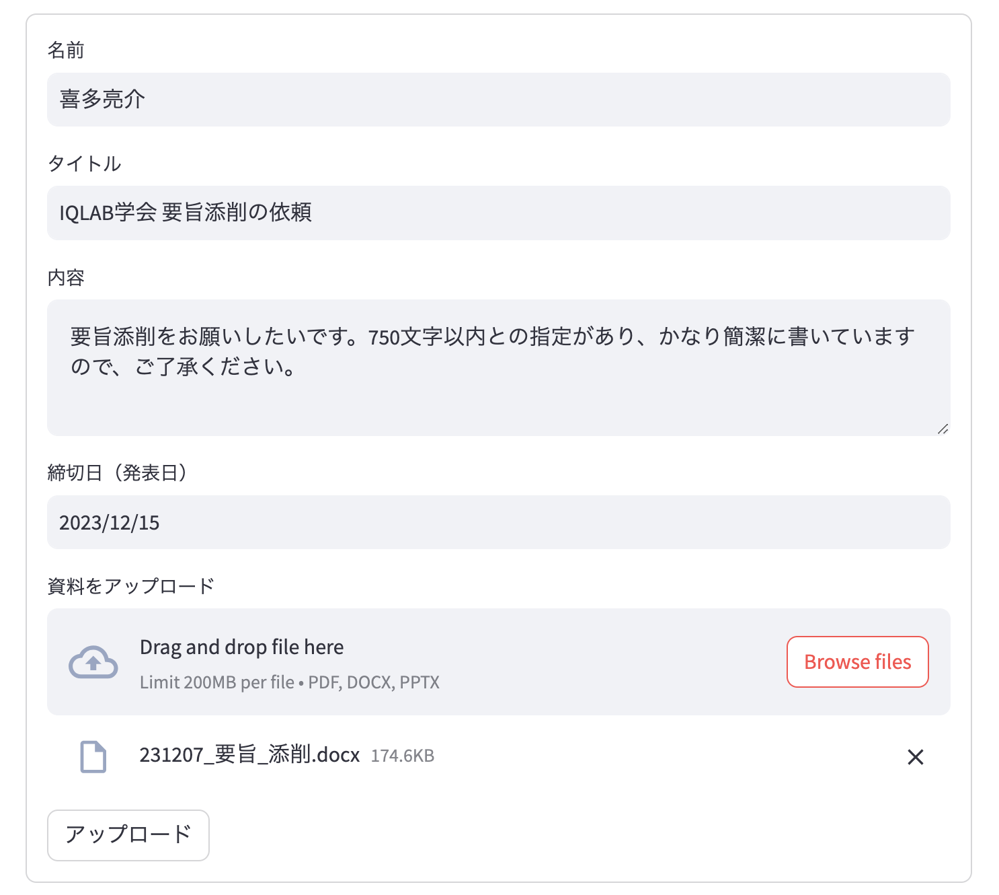
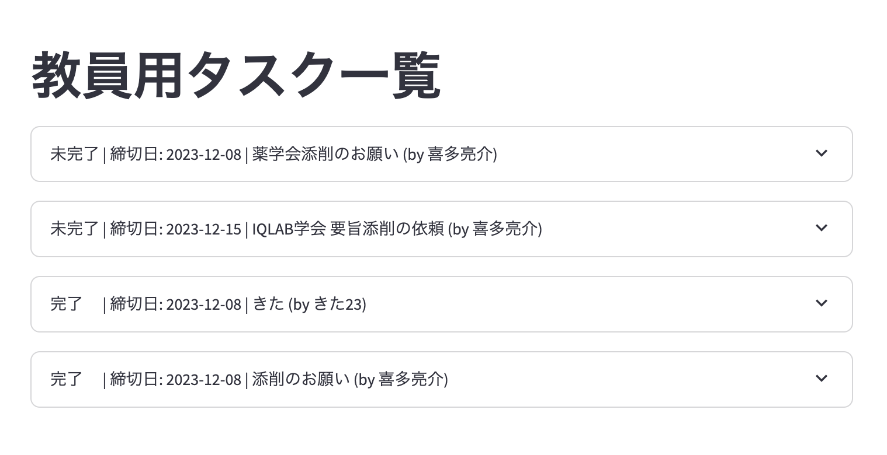
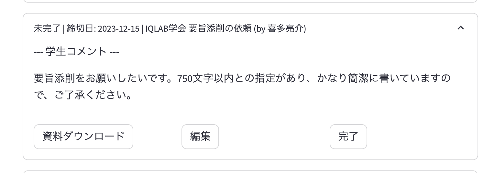

## 選考課題 タスク管理アプリ

### 使い方

```
pip install -r requirements.txt

streamlit run app.py
```
学生側：アップロードUI


教員側：タスク一覧UI



教員側：タスク詳細UI



タスク管理アプリを作成する上で適した要件は、利用ユーザーのニーズに依存するため、以下のような簡単な前提を置いて開発を行った。


### 課題設定
■ 前提
主体：学生20名を抱える、研究室の教授

課題：日常的に所属学生の資料添削を行なっており、各添削タスクの管理に困っている。今回は理由として以下のものを想定した。

- メール、スラック、口頭、様々なチャネルから添削依頼が学生から来る。

解決すべき課題

- 教員側：複数チャネルを経由しての添削依頼があるため、タスク管理アプリを利用しようと思っても、タスクを入力する手間がかかり使いにくさを感じている。

### 提供価値・要件定義

学生側UIと教員側UIを分離し、

- 学生側UIとして以下の要件を定義する。 
  - 資料アップロードのチャネルを本アプリからのみとし、
  - 名前、要件名、内容、締切日、資料ファイルをアップロードする。

- そうすることで、教員側は、
  - 学生の資料アップロードをトリガーとして教員側のタスクが設定されるため、教員のタスク管理コストを削減できる。
  - よって、資料添削に集中でき、未完了・完了タスクを一覧で見れるため、添削依頼の見落としも防ぐことが可能。   

### 実装方法に対する説明

機能・UI・実行ファイルを区別し、開発しやすいようなディレクトリ構成にした。より機能が増え、関数が増える場合は、view, controller のようにさらに構造化することも考える。

また、UIがユーザーごとに二種類あるため、app.pyでUIを管理し、切り替え可能にした。

簡易的なDBとして、storage.csvを用意し、データの読み込み、更新、削除の機能を実装した。

教員側UIでは、より良いUXを意識し、以下のことに気をつけた。
- タスク一覧が一目でわかるように、必要な情報だけを簡潔にリスト化し、クリックすることで詳細情報が見れるように設計した、
- 未完了のタスクが優先的に並ぶように実装した。

また、以下にディレクトリ構成を示す。

■ ディレクトリ構成

```
task-manager-app/
│
├── app.py                 # アプリのメインエントリポイント
│
├── professor_ui.py        # 教員用UI
│
├── student_ui.py          # 学生用UI
│
├── storage.py             # タスクデータの読み込み、保存、更新、削除を扱う
│
├── storage.csv            # タスクデータのDB
│
├── storage/               # 添削ファイルを保存するディレクトリ
│   ├── task1.docx         # ドキュメント例１
│   ├── task2.pdf          # ドキュメント例２
│   └── ...
│
└── requirements.txt       # 必要なPythonパッケージのリスト

```

### 複雑な処理に対する説明

■ 教員側：編集機能のstate管理

`st.session_state['editing_task_id']`を定義し、編集UIを表示するか否かを制御した。streamlitはPythonでUIを実装するため、stateの管理でインタラクティブなUIを実装することになるため少々複雑な処理を書くことになる。